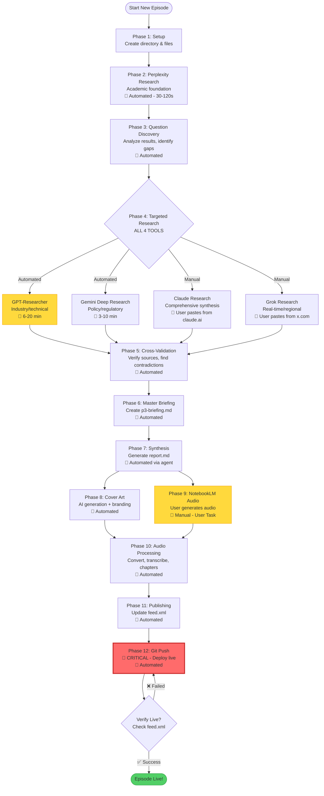
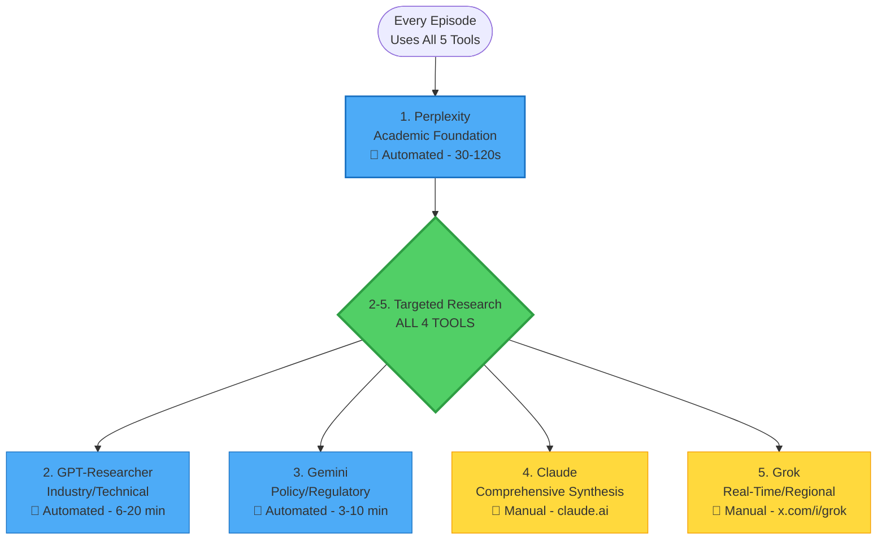

# Personal Podcast Feed

A simple self-hosted podcast feed using GitHub Pages.

## Episode Creation Workflow



## Research Tool Selection

**🚨 DEFAULT: USE ALL 5 TOOLS FOR EVERY EPISODE**



**Rare exceptions:** Only skip a tool if its focus area is truly irrelevant to the topic.

## File Organization

```
podcast/episodes/YYYY-MM-DD-topic-slug/
├── research/                    # Research organized by phase
│   ├── p1-brief.md             # Initial research brief
│   ├── p2-perplexity.md        # Academic research
│   ├── p2-chatgpt.md           # Industry/technical (GPT-Researcher)
│   ├── p2-gemini.md            # Policy/regulatory
│   ├── p2-claude.md            # Comprehensive synthesis (manual)
│   ├── p2-grok.md              # Real-time/regional (manual)
│   ├── p3-briefing.md          # Cross-validated synthesis
│   └── documents/              # PDFs, papers
├── logs/                        # Process logs
│   ├── prompts.md              # All prompts used
│   └── metadata.md             # Publishing metadata
├── tmp/                         # Temporary files
│   └── *_transcript.json       # Full Whisper output
├── cover.png                    # Episode cover art
├── report.md                    # Final narrative report
├── sources.md                   # Source documentation
├── YYYY-MM-DD-slug.mp3         # Final audio with chapters
└── YYYY-MM-DD-slug_chapters.json
```

---

## Quick Start

### Adding a New Episode

Use the automated workflow via Claude Code:
```
/podcast-episode
```

Or follow the `.claude/skills/new-podcast-episode.md` workflow manually.

### Manual Publishing (Legacy)

1. **Create your MP3 file** using your preferred audio tools
2. **Name it**: `YYYY-MM-DD-title-slug.mp3` (e.g., `2025-01-19-intro-to-math.mp3`)
3. **Add to episodes folder**: Drop the file into `podcast/episodes/`
4. **Update feed.xml**:
   - Copy an existing `<item>` block
   - Update: title, description, pubDate, file URL, file size, duration, guid
5. **Check episode count**: If more than 8 episodes exist:
   - Delete oldest MP3 from `episodes/`
   - Remove oldest `<item>` from feed.xml
   - Purge from git history (see below)
6. **Commit and push**

### Purging Old Episodes from Git History

When you delete an episode, remove it from git history to save space:

```bash
# Install BFG Repo-Cleaner (one-time setup)
brew install bfg

# Purge the old file
bfg --delete-files "old-episode.mp3" .git
git reflog expire --expire=now --all
git gc --prune=now --aggressive
git push --force
```

### Subscribe to Your Feed

Once GitHub Pages is enabled, subscribe to:
```
https://research.yuda.me/podcast/feed.xml
```

## Limits

- Maximum 8 episodes at a time
- Each file must be under 100 MB
- Repository should stay under 1 GB total

## File Sizes

For reference, typical podcast bitrates:
- 64 kbps = ~29 MB per hour
- 96 kbps = ~43 MB per hour
- 128 kbps = ~58 MB per hour (recommended)

## Legend

- 🤖 **Automated** - Claude Code handles this automatically
- 👤 **Manual** - User action required
- 🚨 **Critical** - Must not be skipped
