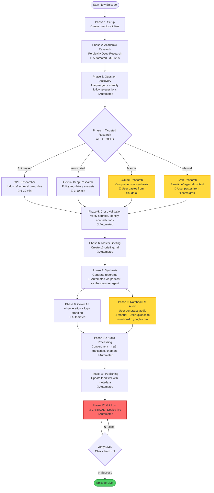

# Personal Podcast Feed

A comprehensive self-hosted podcast publishing system with automated research, audio processing, and GitHub Pages deployment.

## Overview

This system provides end-to-end podcast episode creation from research through publication:

- **Automated Research Pipeline**: Multi-source deep research using Perplexity, Gemini, GPT-Researcher
- **Manual Research Integration**: Easy incorporation of Claude.ai and Grok research
- **Audio Processing**: Local Whisper transcription, AI chapter generation, metadata embedding
- **Cover Art Generation**: AI-generated imagery with automated branding
- **Publishing**: Automated RSS feed updates and GitHub Pages deployment

**Live Feed:** `https://research.yuda.me/podcast/feed.xml`

## Complete Episode Workflow

The podcast creation follows a 12-phase workflow defined in `.claude/skills/new-podcast-episode.md`:



**Legend:**
- 🤖 **Automated** - Claude Code handles automatically
- 👤 **Manual** - User action required
- 🚨 **Critical** - Must not be skipped

## Research Tools

### Automated Research Tools

All tools auto-save output and logs to organized files.

**1. Perplexity Deep Research** (`perplexity_deep_research.py`)
- **Speed:** 30-120 seconds
- **Focus:** Academic studies, peer-reviewed papers, meta-analyses
- **Usage:** Phase 2 - Academic foundation for every episode
- **API Key:** `PERPLEXITY_API_KEY`

**2. Gemini Deep Research** (`gemini_deep_research.py`)
- **Speed:** 3-10 minutes
- **Focus:** Policy analysis, regulatory frameworks, strategic context
- **Usage:** Phase 4 - Policy/regulatory dimensions
- **API Key:** `GOOGLE_AI_API_KEY`

**3. GPT-Researcher** (`gpt_researcher_run.py`)
- **Speed:** 6-20 minutes
- **Focus:** Multi-agent comprehensive research, 100+ sources
- **Usage:** Phase 4 - Industry/technical deep dive
- **API Keys:** `OPENAI_API_KEY`, `TAVILY_API_KEY`, `ANTHROPIC_API_KEY`

### Manual Research Integration

**4. Claude Research** (manual)
- **Platform:** claude.ai
- **Focus:** Comprehensive synthesis, nuanced analysis
- **Usage:** Phase 4 - User pastes results into `research/p2-claude.md`

**5. Grok Research** (manual)
- **Platform:** x.com/i/grok
- **Focus:** Real-time information, regional context
- **Usage:** Phase 4 - User pastes results into `research/p2-grok.md`

**Default Strategy:** Use all 5 research tools for comprehensive coverage. Only skip a tool if its focus area is genuinely irrelevant to the topic.

See `podcast/tools/README.md` for detailed tool documentation.

## Audio Processing Tools

### Transcription

**Local Whisper** (`transcribe_only.py`)
- Fast, accurate transcription with no API costs
- Models: `tiny` (fastest), `base` (recommended), `small`, `medium` (best quality)
- No API key required - runs locally

```bash
python transcribe_only.py episode.mp3 --model base
```

### Chapter Generation

**AI Chapter Analysis** (`generate_chapters.py`)
- Analyzes full transcript to identify natural topic transitions
- Creates 10-15 chapters for 30-40 minute episodes
- Generates both FFmpeg and Podcasting 2.0 formats
- Requires: `ANTHROPIC_API_KEY`

```bash
python generate_chapters.py episode.mp3 --transcript episode_transcript.json
```

### Cover Art

**AI Cover Generation** (`generate_cover.py`)
- Auto-generates prompts from report.md
- Creates episode-specific cover art
- Requires: `OPENROUTER_API_KEY`

```bash
python generate_cover.py episode-dir --auto
```

**Logo Branding** (`add_logo_watermark.py`)
- Adds Yudame Research logo
- Series/episode text overlay
- Yellow border branding

```bash
python add_logo_watermark.py cover.png --series "Series Name" --episode "Ep 3"
```

## Episode Directory Structure

```
podcast/episodes/YYYY-MM-DD-topic-slug/
├── research/                           # Research organized by phase
│   ├── p1-brief.md                    # Initial research brief
│   ├── p2-perplexity.md               # Academic foundation
│   ├── p2-grok.md                     # Real-time/regional
│   ├── p2-chatgpt.md                  # GPT-Researcher industry/technical
│   ├── p2-gemini.md                   # Policy/regulatory
│   ├── p2-claude.md                   # Manual Claude research
│   ├── p3-briefing.md                 # Cross-validated synthesis
│   └── documents/                     # PDFs, papers
├── logs/                               # Process logs
│   ├── prompts.md                     # All prompts used
│   └── metadata.md                    # Publishing metadata
├── tmp/                                # Temporary files
│   └── *_transcript.json              # Full Whisper output
├── cover.png                           # Episode cover art (~500KB)
├── report.md                           # Final narrative report (~20KB)
├── sources.md                          # Source documentation
├── YYYY-MM-DD-slug.mp3                # Final audio with chapters (~30MB)
├── YYYY-MM-slug_chapters.txt          # FFmpeg metadata format
└── YYYY-MM-DD-slug_chapters.json      # Podcasting 2.0 format
```

**Organization Principles:**
- **Phase prefixes** (p1, p2, p3) enable chronological sorting
- **Individual tool files** prevent race conditions during parallel execution
- **Root directory** contains only final publishable outputs
- **Logs separated** for organization and debugging
- **Temporary files isolated** in tmp/ directory

## Quick Start

### Create a New Episode

Use the automated workflow via Claude Code:

```
/podcast-episode
```

This triggers the complete 12-phase workflow from `.claude/skills/new-podcast-episode.md`.

### Available Skills

Claude Code provides specialized agents for each phase:

- **`new-podcast-episode`** - Complete workflow orchestration
- **`perplexity-deep-research`** - Phase 2 academic research
- **`gemini-deep-research`** - Phase 4 policy/regulatory research
- **`gpt-researcher`** - Phase 4 industry/technical research
- **`podcast-cover-art`** - Phase 8 cover generation
- **`podcast-audio-processing`** - Phase 10 audio pipeline
- **`podcast-feed-validator`** - Validate feed.xml compliance

### Manual Audio Processing

If you need to process audio manually:

```bash
cd podcast/episodes/YYYY-MM-DD-slug

# 1. Convert m4a to mp3
ffmpeg -i original.m4a -codec:a libmp3lame -b:a 128k YYYY-MM-DD-slug.mp3 -y

# 2. Transcribe
cd ../../tools
python transcribe_only.py ../episodes/YYYY-MM-DD-slug/YYYY-MM-DD-slug.mp3 --model base

# 3. Generate chapters
python generate_chapters.py ../episodes/YYYY-MM-DD-slug/YYYY-MM-DD-slug.mp3 \
  --transcript ../episodes/YYYY-MM-DD-slug/YYYY-MM-DD-slug_transcript.json

# 4. Embed chapters
cd ../episodes/YYYY-MM-DD-slug
ffmpeg -i YYYY-MM-DD-slug.mp3 -i YYYY-MM-DD-slug_chapters.txt \
  -map_metadata 1 -codec copy temp.mp3 -y
mv temp.mp3 YYYY-MM-DD-slug.mp3
```

## Environment Setup

### API Keys

Create `.env` file in `podcast/tools/`:

```bash
# Required for automated research
PERPLEXITY_API_KEY=pplx-...
GOOGLE_AI_API_KEY=...
OPENAI_API_KEY=sk-...
ANTHROPIC_API_KEY=sk-ant-...
OPENROUTER_API_KEY=sk-or-...
TAVILY_API_KEY=tvly-...

# Optional
XAI_API_KEY=...
```

Get API keys:
- [Perplexity](https://www.perplexity.ai/settings/api) - Academic research
- [Google AI Studio](https://aistudio.google.com/apikey) - Gemini Deep Research
- [OpenAI](https://platform.openai.com/api-keys) - GPT models
- [Anthropic](https://console.anthropic.com/settings/keys) - Chapter generation
- [OpenRouter](https://openrouter.ai/keys) - Cover art generation
- [Tavily](https://tavily.com/) - Enhanced web search

### System Requirements

- **Python:** 3.12+
- **FFmpeg:** 8.0+ (for audio processing)
- **Git:** For version control and deployment

### Python Dependencies

```bash
cd podcast/tools
pip install -r requirements.txt
```

Or use `uv` (recommended for GPT-Researcher):

```bash
curl -LsSf https://astral.sh/uv/install.sh | sh
uv pip install -r requirements.txt
```

## Publishing

### Feed Updates

After audio processing, update `podcast/feed.xml`:

1. Insert new `<item>` block after `<channel>` metadata
2. Include:
   - Title, description with report link
   - Validated source links
   - pubDate (RFC 2822 format)
   - Enclosure URL, length (bytes), type
   - Duration (HH:MM:SS or MM:SS)
   - Keywords

3. Commit and push to deploy

### GitHub Pages

- **URL:** `https://research.yuda.me/podcast/feed.xml`
- **Deploy time:** 2-3 minutes after push
- **Source:** main branch, root folder
- **Configuration:** `.nojekyll` file disables Jekyll processing

Verify settings: Repository Settings → Pages

## Repository Limits

To maintain GitHub Pages compliance and performance:

- **Maximum:** 8 episodes at a time
- **Per-file limit:** 100 MB
- **Repository total:** Keep under 1 GB
- **Target size:** ~30 MB per 30-40 min episode (128kbps mp3)

### Purging Old Episodes

When approaching limits, remove episodes from git history:

```bash
# Install BFG Repo-Cleaner (one-time)
brew install bfg

# Purge old file
bfg --delete-files "old-episode.mp3" .git
git reflog expire --expire=now --all
git gc --prune=now --aggressive
git push --force
```

## File Naming Convention

- **Episodes:** `YYYY-MM-DD-topic-slug.mp3`
- **Transcripts:** `YYYY-MM-DD-topic-slug_transcript.json`
- **Chapters:** `YYYY-MM-DD-topic-slug_chapters.{txt,json}`
- **Cover art:** `cover.png`

## Audio Specifications

### Target Encoding

- **Format:** MP3
- **Bitrate:** 128 kbps (recommended balance of quality/size)
- **Sample rate:** 44.1 kHz
- **Channels:** Mono or Stereo

### Reference Sizes

- **64 kbps:** ~29 MB per hour
- **96 kbps:** ~43 MB per hour
- **128 kbps:** ~58 MB per hour (recommended)

## Chapter Guidelines

- **Count:** 10-15 chapters for 30-40 minute episodes
- **Duration:** 2-4 minutes per chapter
- **Method:** Analyze full transcript to identify natural topic transitions
- **Formats:**
  - `_chapters.txt` - FFmpeg metadata (TIMEBASE=1/1000, milliseconds)
  - `_chapters.json` - Podcasting 2.0 (startTime in seconds)

## Research Methodology

Prompts emphasize rigorous research standards:

- Prioritize peer-reviewed studies and meta-analyses
- Distinguish correlation from causation
- Report effect sizes and practical significance
- Note study populations and generalizability
- Compare individual studies against meta-analyses
- Identify preliminary vs. well-replicated findings
- Note funding sources and conflicts of interest
- Include contradictory findings and uncertainties
- Cite specific studies with proper attribution

Template available in `.claude/skills/new-podcast-episode.md`.

## Episode Description Best Practices

- **Hook:** 1-2 compelling sentences highlighting key topics
- **Report link:** Always include `https://research.yuda.me/podcast/episodes/YYYY-MM-DD-slug/report.md`
- **Key sources:** 3-5 validated official links
- **Priority order:** Official legislation/regulation → Academic analysis → Primary sources
- **Validation:** Use WebSearch to find, WebFetch to validate official URLs

## Common Workflows

### Full Episode Creation
```bash
cd /Users/valorengels/src/research
claude-code
> /podcast-episode
```

### Research Only
```bash
cd podcast/tools

# Quick academic research
python perplexity_deep_research.py "Research prompt" --output results.md

# Comprehensive multi-source
uv run python gpt_researcher_run.py --file prompt.txt --output results.md

# Policy/regulatory analysis
python gemini_deep_research.py --file prompt.txt --output results.md
```

### Audio Processing Only
```bash
cd podcast/tools

# Full pipeline with organized logging
python transcribe_only.py ../episodes/episode-dir/episode.mp3 \
  --model base --log-dir ../episodes/episode-dir/logs --quiet

python generate_chapters.py ../episodes/episode-dir/episode.mp3 \
  --transcript ../episodes/episode-dir/episode_transcript.json \
  --log-dir ../episodes/episode-dir/logs --quiet
```

### Cover Art Generation
```bash
cd podcast/tools

# Generate and brand
python generate_cover.py ../episodes/episode-dir --auto
python add_logo_watermark.py ../episodes/episode-dir/cover.png \
  --series "Series Name" --episode "Ep 3: Topic"
```

## Troubleshooting

### API Key Errors

**Error:** `ERROR: [SERVICE]_API_KEY not found`

**Solution:**
1. Verify `.env` exists: `ls -la podcast/tools/.env`
2. Check key is set: `grep [SERVICE]_API_KEY podcast/tools/.env`
3. Get key from provider and add to `.env`

### Import Errors

**Error:** `ModuleNotFoundError: No module named 'X'`

**Solution:**
```bash
cd podcast/tools
pip install -r requirements.txt
```

### FFmpeg Not Found

**Error:** `ffmpeg: command not found`

**Solution:**
```bash
# macOS
brew install ffmpeg

# Linux
sudo apt install ffmpeg
```

### Rate Limits

**Error:** `429 Too Many Requests`

**Solution:**
- Wait 60 seconds before retrying
- Check API usage dashboard
- Consider upgrading API plan

## Development

### Testing

```bash
cd podcast/tools
pytest
```

### Documentation

- **Tools:** `podcast/tools/README.md` - Detailed tool reference
- **Workflow:** `.claude/skills/new-podcast-episode.md` - Complete workflow
- **Project:** `CLAUDE.md` - Repository context for Claude Code

## Related Documentation

- [Episode Workflow](./.claude/skills/new-podcast-episode.md) - Complete 12-phase workflow
- [Tools Reference](./tools/README.md) - Detailed tool documentation
- [Project Context](../CLAUDE.md) - Repository overview
- [RSS Specification](../docs/RSS-specification.md) - Feed requirements

---

**Status:** Active production system supporting multiple podcast series with automated research, audio processing, and publishing pipeline.
